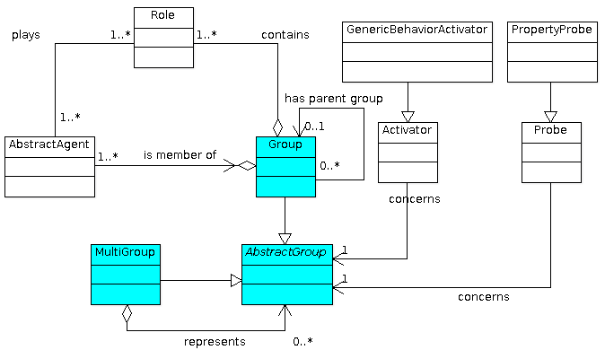
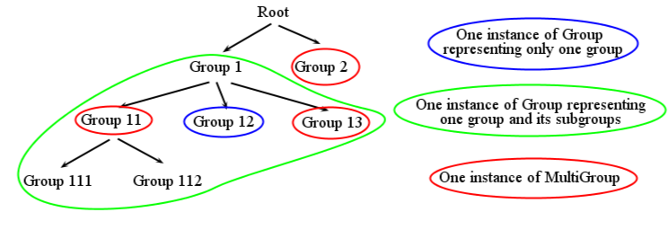

MaDKitLanEdition: Multiagent Development Kit (Lan Edition)
==========================================================

What is MaDKit ?
-----------------

MaDKit is an open source multiagent-based development platform written in Java.
MaDKit is designed to easily build distributed applications and simulations using the multiagent paradigm and features:

* Artificial agents creation and life cycle management
* An organizational infrastructure for communication between agents, structuring the application
* High heterogeneity in agent architectures: No predefined agent model
* Multi-Agent based simulation and simulator authoring tools
* Multi-agent based distributed application authoring facilities

In contrast to conventional approaches, which are mostly agent-centered, MaDKit follows an organization-centered approach [OCMAS][1]
so that there is no predefnied agent model in MaDKit. So, MaDKit is built upon the AGR (Agent/Group/Role) organizational model:
MaDKit agents play roles in groups and thus create artificial societies.

What is MaDKitLanEdition ?
----------------------------

###### MadKitLanEdition integrates :
* MadKitGroupExtension's features in a native way
* Advanced network futures which enables to connect several peers between them, and emulate a secured multi-agent system that virtually evolves into the same environment, i.e. the same virtual machine. 

Tutorials are not already available. For now, you can find inspiration with the available demos. Excutable jar files are available on the corresponding section (see below). 
You can also find inspiration into Junit tests.

###### Network futures of MaDKitLanEdition :
* Several network protocols
    * Peer to peer secured or unsecured connections
    * Client/server secured or unsecured connections
    * Several encryption algorithms
* Access protocol manage peer to peer login and gives rights to specified groups of agents. A specific login protocol has been established in order to exchange password or secret keys, without compromising them if the distant peer is not a trusting peer. Same thing with the user login.
* possibility to connect randomly to one of the given servers (simple load balancing)
* ability to ban IP's that generates a number of anomalies above a threshold. Banned IP's are stored into a database. A white ip list is possible.
* several levels of ban duration
* ability to limit DDoS attacks (only limit). If a lot of peers ask for queries at the same time, the same will block every new query until old queries have been managed, this in order to avoid the explosion of the memory consumption.
* Peers can communicate through several middle peers (Transfer connection). The system is able to make connections indirect, but secured (impossible to decode data for middle peers if the connection is secured).
* UPNP IGD futures :
    * Auto-connect with peers located into local network
    * Auto-open a router's port to enable direct connection with distant peers.
    * If no opened port is available or if no UPNP IGD rooter is available for two concerned distant peers, the system can choose to make an indirect connection between the two peers, through a dedicated server. This server is not able to decode messages between the two peers if the connection is secured.  
* enable to send simples messages between agents, or big data transfers (like files) between agents.
* individual messages can be encrypted or not
* multiple connections are possible between two same peers (through multiple interfaces). The system will use each connection in parallel by choosing for each packet to send the connection which offer more bandwidth or which is less busy
* The system detects hot plug of network interfaces
* middle man is limited by using an interfaced kernel address, when a peer try to use the same kernel address than an other peer.
* Conversation ID's are also interfaced for security reason
* Agents that send distant messages are blocked until the message is sent, this in order to avoid increasing memory use.
* possibility to get metrics for each connection, and for each big data transfer. 
* Connections are automatically closed if the distant peer does not answer to ping messages. Lost messages are identified, and messages which have not been sent are returned to sender agents. 
* large scale conception

###### Other futures of MaDKit Lan Edition :
* Agents can launch tasks (multi-threaded)
* AgentFakeThread is an agent whose react only when it receives a message. Theses kind of agents are multi-threaded.
* Possibility to define a blackboard for agents
* when broadcasting a message, possibility for an agent to get all answers in one time.
* Auto-request roles are possible. Agents can request roles only if they are requested by other agents. 

###### Madkit Group extension futures

On MadKit, a group contains several agents which plays several roles. In MadKitLanEdition, groups are represented as a hierarchy. So one group can be contained in a parent group, which can be contained in its turn in another parent group. In the same way, a group can contain several sub groups. That can be very usefull for the design of advanced multi-agent systems.

The class AbstractGroup is the super class of Group and MultiGroup. The class Group can represent one group, or one group and all its subgroups. The class MultiGroup can group several AbstractGroup which can be part of several branches of the group hierarchy. Then it is possible with the class MultiGroup to repesent a group, and all its subgroups, but also a group and another without requiring that must be part of the same branch of the tree of groups.

Note that one agent can't be attached to a MultiGroup or a Group that represents itself and its subgroups. It can be attached to a Group that represent only itself. This choice has been done to not loose the user. Indeed, if the agent could handle a set of groups, it should handle all groups represented by this set. However, this set aims to evolve over the time, especially if it represents subgroups. So the groups of the agent should evolve over the time. We have decided that this is too much ambigous for the user.

How to use it ?
---------------
### With Gradle :

Adapt into your build.gradle file, the next code :

	...
	repositories {
		...
		maven {
	       		url "https://artifactory.distri-mind.fr/artifactory/gradle-release"
	   	} 
		...
	}
	...
	dependencies {
		...
		compile(group:'com.distrimind.madkit', name: 'MaDKitLanEdition', version: '1.7.0')
		...
	}
	...

To know what last version has been uploaded, please refer to versions availables into [this repository](https://artifactory.distri-mind.fr/artifactory/DistriMind-Public/com/distrimind/madkit/MaDKitLanEdition)
### With Maven :
Adapt into your pom.xml file, the next code :

	<project>
		...
		<dependencies>
			...
			<dependency>
				<groupId>com.distrimind.madkit</groupId>
				<artifactId>MaDKitLanEdition</artifactId>
				<version>1.7.0</version>
			</dependency>
			...
		</dependencies>
		...
		<repositories>
			...
			<repository>
				<id>DistriMind-Public</id>
				<url>https://artifactory.distri-mind.fr/artifactory/gradle-release</url>
			</repository>
			...
		</repositories>
	</project>

To know what last version has been uploaded, please refer to versions availables into [this repository](https://mahdjoub.net/artifactory/DistriMind-Public/com/distrimind/madkit/MaDKitLanEdition)

How to get demos ?
------------------

To get MaDKitLanEditions demos, please download the lastest [repository](https://artifactory.distri-mind.fr/artifactory/DistriMind-Public/com/distrimind/madkitdemos/MaDKitLanEditionDemos)

[1]: http://www.lirmm.fr/~fmichel/publi/pdfs/ferber04ocmas.pdf
